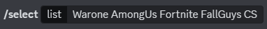
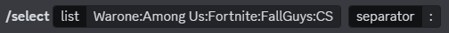

# WhatsThePlan Discord Bot

Welcome to the WhatsThePlan Discord Bot! This Elixir-based bot, made with [Nostrum](https://github.com/Kraigie/nostrum), is designed to help you and your server members make decisions when you can't decide which game to play or when you need to choose between various options. Simply provide a list of options, and WhatsThePlan will randomly select one for you. While it's primarily focused on games, it can be used for any decision-making scenario.

## Features

- **Random Selection:** WhatsThePlan randomly selects one option from the list you provide, making decision-making fun and easy.
- **Customizable Separator:** You can specify the separator to use when providing the list of options, making it flexible for various use cases.
- **Interactive Commands:** The bot utilizes Discord Application Commands, making it easy to use with slash commands.

## Usage

To use the WhatsThePlan Discord Bot, follow these simple steps:

1. Invite the WhatsThePlan bot to your Discord server using this [link](https://bit.ly/whats_the_plan).
2. Use the `/select` command with the list of options you want to choose from and, if needed, specify the separator. For example:

    

    Or with a custom separator 

    

3. WhatsThePlan will respond with the randomly selected option, and your decision is made!

## Commands

- `/select [list] [separator]`: Randomly selects one option from the provided list of options, separated by the specified separator. If no separator is provided, it defaults to a space.

## Installation

If you want to host your own instance of the WhatsThePlan Discord Bot, follow these steps:

1. Clone this repository.
2. Configure your Elixir environment and dependencies.
3. Set up a Discord Application and bot account on the [Discord Developer Portal](https://discord.com/developers/applications).
4. Obtain your bot token and set it as an environment variable.
5. Customize the bot's behavior as needed.
6. Build and run the bot.

## Contributors

- [SuriSureda](https://github.com/SuriSureda) - Bot Developer

## Support and Issues

If you encounter any issues or have suggestions for improvements, please open an issue on this GitHub repository.

## License 

The WhatsThePlan Discord Bot is open-source and available under the [MIT License](LICENSE). Feel free to fork, modify, and use it as you see fit for your Discord server.

Enjoy making decisions with WhatsThePlan!
